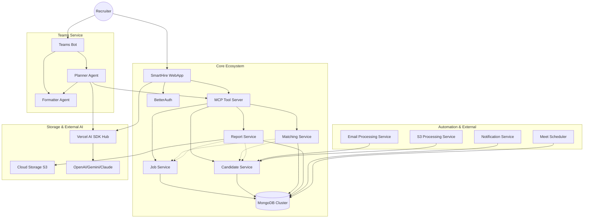

# 🚀 SmartHire AI: Next-Gen Recruitment Platform

SmartHire AI is a state-of-the-art, microservices-based recruitment ecosystem designed to automate and augment the hiring process using advanced AI. From automated candidate extraction to intelligent job matching and interview scheduling, SmartHire AI streamlines the entire recruiter workflow.

---

## 🛠 Technology Stack


---

# Video Overview

[](https://www.youtube.com/watch?v=WhU6G5fDGKw)

## 🏗 System Architecture

The following diagram illustrates the interaction between the different microservices:



---

## 📦 Microservices Overview

| Service                        | Description                                                                       |
| :----------------------------- | :-------------------------------------------------------------------------------- |
| **`smart_hire_webapp`**        | The main Next.js interface for managing jobs, candidates, and AI settings.        |
| **`smart_hire_mcp_server`**    | Model Context Protocol server that exposes hiring tools directly to AI agents.    |
| **`candidate_service`**        | Handles candidate lifecycle, CV parsing, and metadata extraction.                 |
| **`job_service`**              | Manages job descriptions, requirements, and status tracking.                      |
| **`matching_service`**         | Computes compatibility scores between candidates and jobs using LLMs.             |
| **`report_service`**           | Generates professional PDF matching reports and contracts via PodPDF.             |
| **`notification_service`**     | Runs background cron jobs for meeting reminders and high-score alerts.            |
| **`meet_scheduler`**           | Orchestrates Google Meet and Microsoft Teams interview integrations.              |
| **`email_processing_service`** | Monitors IMAP mailboxes to automatically ingest incoming resumes.                 |
| **`s3_processing_service`**    | Watches S3 buckets for new PDF uploads to trigger candidate extraction.           |
| **`teams_bot_service`**        | Microsoft Teams integration with a dual-agent architecture (Planner & Formatter). |

---

## 🤖 Teams Bot Architecture (Port 3000)

The SmartHire Teams Bot is built using a modern dual-agent pattern to provide a seamless conversational experience within Microsoft Teams:

### 🧩 The Planner Agent

- **MCP Integration**: Directly connected to the `smart_hire_mcp_server`.
- **Tool Orchestration**: Decides which tools to call based on user intent (e.g., "Find candidates for the JS developer role").
- **Human-in-the-loop**: Manages approval flows for sensitive operations that require recruiter confirmation before execution.

### 🎨 The Formatter Agent

- **UX Transformation**: Takes raw JSON responses from tools and the Planner.
- **Adaptive Cards**: Converts data into rich, interactive Microsoft Teams Adaptive Cards.
- **Engagement**: Ensures that lists of candidates, job details, and matching reports are beautifully rendered and actionable within the Teams interface.

---

## 🚀 Getting Started

### Prerequisites

- [Docker & Docker Compose](https://docs.docker.com/get-docker/)
- [Bun Runtime](https://bun.sh/) (for local development)

### 1. Environment Configuration

#### Direct Parameter Injection

Use is ENV file struct:

copy and fill this env file

```.env
ENCRYPTION_KEY=
# Secret key used to encrypt LLM API keys data.
# Generate it with: openssl rand -base64 32


BETTER_AUTH_SECRET=
# Secret for session/JWT signing in the web app.
# Generate with: openssl rand -base64 32

UPSTASH_SEARCH_REST_URL=
# Upstash Search/Vector DB URL.
# Get from Upstash console → Database → REST URL.

UPSTASH_SEARCH_REST_TOKEN=
# Upstash API token.
# Get from Upstash console → REST Token.


ENDPOINT=
# S3 storage endpoint (AWS S3, MinIO, Supabase Storage etc.)
# AWS example: https://s3.amazonaws.com

REGION=
# Cloud region of your S3 bucket.
# Example: eu-west-1

ACCESS_KEY_ID=
# S3 access key.
# Create in AWS IAM → Users → Security Credentials.

SECRET_ACCESS_KEY=
# S3 secret key.
# Generated with ACCESS_KEY_ID in AWS IAM.

# you may need to create a azure Bot in "azure Portal" to get those credentials (pl use single talent app)
CLIENT_ID=
# OAuth client ID.
# Get from Microsoft Azure App Registration or Google Cloud Console.

CLIENT_SECRET=
# OAuth client secret.
# Generated in Azure app registration.

TENANT_ID=
# Microsoft Azure tenant ID.
# Found in Azure Active Directory.

NEXT_PUBLIC_WEBSITE_URL=http://localhost:3000
# Public URL of the web app used in emails.

BETTER_AUTH_URL=http://localhost:3000
# Base URL of the web app for authentication callbacks.

```

```bash
docker-compose --env-file .env up -d
```

This works because the `docker-compose.yml` is configured to "pull" these variables from your shell's environment using the `${VARIABLE_NAME}` syntax.

### 2. Deployment via Docker Compose

SmartHire is fully containerized. To spin up the entire stack:

```bash
# Build and start all 12 containers (MongoDB + 11 Services)
docker-compose up -d --build
```

The application will be available at:

- **WebApp**: [http://localhost:3000](http://localhost:3000)
- **Teams Bot**: [http://localhost:3333/api/messages](http://localhost:3333/api/messages)
- **MCP Server**: [http://localhost:3003](http://localhost:3003)
- **MongoDB**: [localhost:27017](localhost:27017)

---

## 🔒 Security

- **Encrypted Secrets**: Sensitive API keys (OpenAI, SMTP) are encrypted at rest in MongoDB using AES-256.
- **Role-Based Access**: Specialized views for Administrators and Company users.
- **MCP Authorization**: Cross-service tool calls are protected by unique MCP tokens.

---

## 📄 License

This project is proprietary. All rights reserved.
